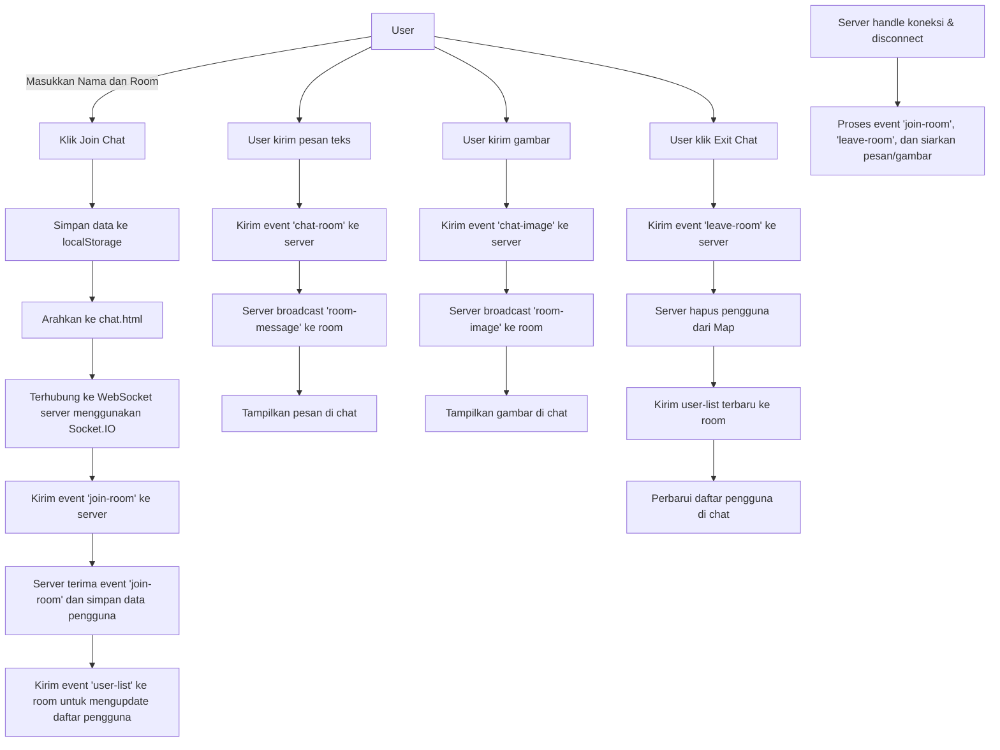

# Laporan Proyek Nest.js

## 1. Pendahuluan

Proyek ini dikembangkan menggunakan framework **Nest.js**, yang berbasis **TypeScript** dirancang untuk membangun aplikasi **server-side** yang **modular**, **scalable**, dan **maintainable**. Dengan mengadopsi prinsip-prinsip **modularitas** dan **dependency injection**, Nest.js memudahkan pengembangan aplikasi yang dapat diperluas dan dikelola dengan mudah dalam jangka panjang.

## 2. 📁 Struktur Folder Proyek

Berikut adalah struktur dasar dari proyek ini:

```
├── node_modules
├── prisma
│   ├── schema.prisma
├── socket
│   ├── css/
│   ├── img/
│   ├── js/
│   ├── chat.html
│   ├── client.html
├── src
│   ├── main.ts
│   ├── app.module.ts
│   ├── prisma.ts
│   ├── app.controller.ts
│   ├── app.service.ts
│   ├── auth.module.ts
│   ├── chat
│   │   │   ├── chat.gateway.ts
│   │   │   ├── chat.gateway.spec.ts
│   │   │   ├── chat.module.ts
│   │   │   ├── chat.service.ts
│   │   │   ├── chat.service.spec.ts
│   ├── mahasiswa-profile
│   │   │   ├── mahasiswa-profile.controller.ts
│   │   │   ├── mahasiswa-profile.controller.spec.ts
│   │   │   ├── mahasiswa-profile.module.ts
│   │   │   ├── mahasiswa-profile.service.ts
│   │   │   ├── mahasiswa-profile.service.spec.ts
│   ├── decorator
│   │   ├── user.decorator.ts
│   ├── dto
│   │   ├── create-mahasiswa.dto.ts
│   │   ├── login-user.dto.ts
│   │   ├── register-user.dto.ts
│   ├── entity
│   │   ├── user.entity.ts
│   ├── guards
│   │   ├── auth.guard.ts
├── test
│   ├── app.e2e-spec.ts
│   ├── jest-e2e.json
├── uploads
├── .env
├── .eslintrc.js
├── .gitignore
├── .prettierrc
├── nest-cli.json
├── package-lock.json
├── package.json
├── README.md
├── tsconfig.build.json
├── tsconfig.json
```

## 3.📜 Project Architecture Diagram
- **User Register & Login**


- **GET, POST, PUT, DELETE (CRUD Operations)**


- **Websocket Chat (CRUD Operations)**



## 4. 🔥 Teknologi yang Digunakan

- **Nest.js** - Framework utama
- **TypeScript** - Bahasa pemrograman utama
- **PostgreSQL/MongoDB** - Database backend
- **TypeORM/Mongoose** - ORM untuk database
- **Swagger** - Dokumentasi API
- **Jest** - Unit testing
- **Docker** - Containerisasi
- **Socket.IO** - Real-time communication (WebSocket)
- **JWT** - Otentikasi dan otorisasi pengguna

## 5.🔧 Instalasi Proyek Nest.js
1. **Install nest js CLI dengan menggunakan perintah**
 ```sh
   npm i -g @nestjs/cli
   ```
2. **Inisialisasi proyek nest js dengan menggunakan perintah**
 ```sh
   nest new nama_proyek
   ```
3. **Masuk ke direktori dengan perintah**
 ```sh
   cd nama_proyek
   ```
   Selanjutnya
 ```sh
   code .
 ```

## 6. 🚀 Penjelasan Setiap File
### 📂 **node_modules/** 📦
Berisi **dependensi proyek** yang diinstal melalui `npm` atau `yarn`. 


### 📁**prisma/schema.prisma**
Schema utama untuk database menggunakan **Prisma ORM**. Berisi definisi tabel dan hubungan antar entitas dalam database.
- **Data Source**: Mengonfigurasi koneksi database, misalnya PostgreSQL atau MongoDB.
- **Generator**: Menentukan bagaimana Prisma akan menghasilkan kode client.
- **Model**: Definisi entitas dalam database, termasuk tipe data, relasi, dan constraints.

Struktur **schema.prisma**:
```prisma
generator client { 
  provider = "prisma-client-js"
}

datasource db {
  provider = "postgresql"
  url      = env("DATABASE_URL")
}

model Mahasiswa {
  nim String @id
  nama String
  kelas String 
  jurusan String
  jenis_kelamin jenis_kelamin 
  foto_profile  String?
}

enum jenis_kelamin {
  L
  P
}

model User {
  id Int @id @default(autoincrement())
  username String @unique
  password String
  role Role @default(USER)
  foto_profile String?
}

enum Role {
  ADMIN
  USER
}
```
### 📂 **socket/** 💬
Berikut adalah file-file dalam **modul socket**, yang menyediakan **antarmuka WebSocket berbasis HTML, CSS, dan JavaScript**:

- **`css/chat.css`** 🎨 → Gaya tampilan untuk halaman **chat**, termasuk layout pesan, tombol kirim, dan animasi UI.
- **`css/client.css`** 🎨 → Gaya tampilan untuk halaman **client**, termasuk desain form login dan tata letak awal aplikasi.
- **`js/script.js`** 🛠️ →
  - Skrip utama untuk menangani **interaksi WebSocket**.
  - Menangani **pengiriman dan penerimaan pesan**.
  - Mengelola **gambar yang dikirim dalam chat**.
  - Mengatur **penyimpanan data pengguna dalam localStorage**.
- **`chat.html`** 💬 →
  - Halaman utama untuk **chat berbasis WebSocket**.
  - Memiliki antarmuka untuk **menampilkan pesan** dan **mengirim teks atau gambar**.
  - Terhubung dengan **socket.io** untuk komunikasi real-time.
- **`client.html`** 🏠 →
  - Halaman awal untuk **memasuki chat**.
  - Mengambil **nama pengguna dan room**, lalu menyimpannya dalam **localStorage** sebelum masuk ke **chat.html**.


### 📂**src/main.ts**
File utama yang digunakan untuk menginisialisasi aplikasi **Nest.js**.

- **Membuat instance aplikasi** menggunakan `NestFactory.create()`.
- **Menggunakan Middleware** seperti `cookie-parser` untuk parsing cookie.
- **Mengaktifkan CORS** dengan konfigurasi tertentu agar aplikasi frontend dapat berkomunikasi dengan backend.
- **Menggunakan `ValidationPipe`** untuk validasi data input secara global.
- **Mengonfigurasi Swagger** untuk mendokumentasikan API di `/api-docs`.
- **Menjalankan server** pada port yang ditentukan dalam environment variable atau default ke `3000`.

### 📂**src/app.module.ts**
Modul utama aplikasi yang mengelola **modul**, **controller**, dan **provider** dalam proyek ini.
- **Mengimpor** `JwtModule`, `ProfileModule`, `MahasiswaProfileModule`, dan `ChatModule`.
- **Mendaftarkan** `AppController` sebagai controller utama.
- **Menyediakan** `AppService` dan `PrismaService` sebagai provider utama.

### 📂**src/prisma.ts**
File yang menangani koneksi ke database menggunakan **Prisma ORM**.

- **Menggunakan `PrismaClient`** dari `@prisma/client` untuk mengelola koneksi ke database.
- **Mengimplementasikan `OnModuleInit`** agar koneksi ke database dibuat saat modul diinisialisasi.
- **Menangani koneksi database** dengan metode `onModuleInit()` yang memastikan aplikasi terhubung dengan database sebelum dijalankan.

### 📂**src/app.controller.ts**
Mengelola endpoint utama aplikasi:
- **POST /register**: Mendaftarkan pengguna baru.
- **POST /login**: Autentikasi pengguna dan mengembalikan token.
- **GET /**: Endpoint dasar yang mengembalikan string Hello World.
- **GET /mahasiswa**: Mengambil daftar mahasiswa dari database.
- **GET /mahasiswa/:nim**: Mengambil data mahasiswa berdasarkan NIM.
- **POST /mahasiswa**: Menambahkan mahasiswa baru ke dalam database.
- **PUT /mahasiswa/:nim**: Memperbarui data mahasiswa berdasarkan NIM.
- **DELETE /mahasiswa/:nim**: Menghapus data mahasiswa berdasarkan NIM.
- **GET /auth**: Endpoint untuk mengecek status autentikasi pengguna.
- **GET /cari-mahasiswa**: Mencari mahasiswa berdasarkan nama atau kelas.

### 📂**src/app.service.ts**
Menyediakan layanan utama yang berhubungan dengan pengguna dan mahasiswa.
- **getHello**: Mengembalikan string dasar sebagai respons awal.
- **getMahasiswa**: Mengambil semua mahasiswa dari database.
- **addMahasiswa**: Menambahkan mahasiswa baru ke dalam database setelah validasi.
- **cariMahasiswa**: Mencari mahasiswa berdasarkan nama atau kelas menggunakan query.
- **getMahasiswByNim**: Mengambil data mahasiswa berdasarkan NIM.
- **menghapusMahasiswa**: Menghapus data mahasiswa berdasarkan NIM.
- **updateMahasiswa**: Memperbarui informasi mahasiswa dalam database.
- **register**: Mendaftarkan pengguna baru dengan hashing password.
- **auth**: Mengautentikasi pengguna berdasarkan ID dari token JWT.
- **login**: Memvalidasi username dan password, serta mengembalikan token JWT jika valid.
Berisi layanan utama seperti:
- Mengelola data mahasiswa (GET, POST, PUT, DELETE).
- Registrasi dan login pengguna dengan hashing password.
- Mengembalikan token JWT untuk autentikasi.

### 📂**src/auth.module.ts** ⚙️
Modul utama untuk autentikasi dan pengelolaan pengguna.
- **Ditandai sebagai Global Module** menggunakan `@Global()` agar dapat digunakan di seluruh aplikasi.
- **Menyediakan** `AppService` dan `PrismaService` untuk layanan otentikasi dan interaksi dengan database.
- **Dapat diekspor** ke modul lain dalam aplikasi.

### 📂**src/chat/** 💡
- **chat.gateway.ts**: Mengelola komunikasi WebSocket untuk fitur chat.
- **chat.gateway.spec.ts**: Pengujian unit untuk `chat.gateway.ts`.
- **chat.module.ts**: Modul utama untuk fitur chat.
- **chat.service.ts**: Menyediakan logika bisnis untuk fitur chat.
- **chat.service.spec.ts**: Pengujian unit untuk `chat.service.ts`.

### 📂 **src/mahasiswa-profile/** 🎓
Berikut adalah penjelasan mengenai file dalam **modul mahasiswa-profile**:

- **`mahasiswa-profile.controller.ts`** 🏛️ → Mengelola **permintaan HTTP** terkait data mahasiswa. Menyediakan endpoint untuk **mengunggah dan mengambil foto profil mahasiswa** berdasarkan NIM.
- **`mahasiswa-profile.controller.spec.ts`** 🧪 → Berisi **pengujian unit** untuk memastikan controller mahasiswa bekerja dengan benar.
- **`mahasiswa-profile.module.ts`** 📦 → Modul utama untuk fitur **mahasiswa profile**, bertanggung jawab dalam mengatur provider dan modul terkait.
- **`mahasiswa-profile.service.ts`** 🔍 → Menyediakan **logika bisnis** untuk fitur mahasiswa, termasuk:
  - **Mengunggah file foto profil** ke sistem
  - **Menyimpan path foto profil ke database menggunakan Prisma ORM**
  - **Mengambil kembali file foto profil berdasarkan NIM mahasiswa**
- **`mahasiswa-profile.service.spec.ts`** 🛠️ → Berisi **pengujian unit** untuk `mahasiswa-profile.service.ts`, memastikan fungsi bisnis seperti **unggah dan pengambilan foto profil** berjalan sesuai harapan.

📌 **Penjelasan Fitur di `mahasiswa-profile.controller.ts`**:
- **`uploadFile`** → Endpoint untuk **mengunggah foto profil mahasiswa**. File disimpan dengan format `nim-timestamp.ext`.
- **`getProfile`** → Endpoint untuk **mengambil foto profil mahasiswa berdasarkan NIM**.

📌 **Penjelasan Fitur di `mahasiswa-profile.service.ts`**:
- **`uploadFile`** →
  - **Memeriksa apakah mahasiswa dengan NIM tersebut ada di database**.
  - **Menyimpan file dalam direktori `uploads/`**.
  - **Memperbarui informasi foto profil mahasiswa di database**.
- **`sendMyFotoProfile`** →
  - **Mengambil path foto profil mahasiswa** dari database.
  - **Mengembalikan file jika ditemukan, atau memberikan error jika tidak ada**.

### 📂 **src/decorator/** 🏷️
Berikut adalah penjelasan mengenai file dalam **modul decorator**:

- **`user.decorator.ts`** 🎭 →
  - **Dekorator kustom** yang digunakan untuk mengambil objek pengguna dari request HTTP.
  - Menggunakan `createParamDecorator` dari NestJS.
  - Mengambil informasi pengguna dari request yang telah di-autentikasi.
  - Pastikan objek `user` dalam request memiliki properti `nim` agar dapat digunakan dalam fitur yang memerlukan identifikasi pengguna.

### 📂 **src/dto/** 📑
Berikut adalah penjelasan mengenai file dalam **modul DTO (Data Transfer Object)**:

- **`create-mahasiswa.dto.ts`** 📝 →
  - Berisi **struktur validasi** untuk pembuatan data mahasiswa baru.
  - Menggunakan `class-validator` untuk memastikan data valid.
  - Memvalidasi **NIM, Nama, Kelas, Jurusan, dan Jenis Kelamin**.

- **`login-user.dto.ts`** 🔐 →
  - DTO untuk **proses login pengguna**.
  - Memastikan bahwa **username dan password** dikirim dalam format yang benar.
  - Menggunakan validasi **IsString, IsNotEmpty, dan Matches**.

- **`register-user.dto.ts`** 🆕 →
  - DTO untuk **registrasi pengguna baru**.
  - Memastikan bahwa **username dan password** dikirim dengan format yang benar.
  - Menggunakan validasi yang sama seperti `login-user.dto.ts`.

DTO ini digunakan untuk memastikan bahwa data yang dikirim melalui API **memiliki format dan tipe yang sesuai** dengan kebutuhan aplikasi.

### 📂 **src/entity/** 🏛️
Berikut adalah penjelasan mengenai file dalam **modul entity**:

- **`user.entity.ts`** 👤 →
  - Mewakili struktur data pengguna dalam aplikasi.
  - Menggunakan `class-transformer` untuk **menyembunyikan password** saat data dikirim.
  - Properti yang tersedia:
    - `id` → ID unik pengguna.
    - `username` → Nama pengguna.
    - `password` (disembunyikan) → Kata sandi pengguna.
    - `role` → Peran pengguna dalam sistem.
    - `foto_profile` → Path ke foto profil pengguna (opsional).


### 📂 **src/guards/** 🔐
Berikut adalah penjelasan mengenai file dalam **modul guards**:

- **`auth.guard.ts`** 🛡️ →
  - **Middleware keamanan** yang digunakan untuk **melindungi endpoint API**.
  - Menggunakan `JwtService` untuk **memverifikasi token JWT** dari header **Authorization**.
  - Jika token valid, user akan dimasukkan ke dalam request dan diteruskan ke handler selanjutnya.
  - Jika token tidak valid atau tidak ada, akan mengembalikan **UnauthorizedException**.
  - Menggunakan **`plainToInstance` dari class-transformer** untuk mengonversi data pengguna ke dalam entitas **User** sebelum diteruskan dalam request.

### 📂 **test/** 🧪
Berikut adalah file-file dalam **modul pengujian (testing)**:

- **`app.e2e-spec.ts`** 🔍 →
  - File ini berisi **pengujian end-to-end (E2E)** untuk memastikan seluruh sistem bekerja sebagaimana mestinya.
  - Menggunakan framework **Jest** untuk melakukan pengujian API dengan pendekatan **black-box testing**.
  - Memverifikasi apakah endpoint berfungsi dengan baik dan mengembalikan respons yang diharapkan.

- **`jest-e2e.json`** ⚙️ →
  - Konfigurasi untuk **pengujian end-to-end menggunakan Jest**.
  - Berisi pengaturan untuk environment pengujian, termasuk konfigurasi database dan skema yang digunakan selama pengujian.

### 📂 **nest-cli.json** 📦
- Berisi konfigurasi khusus untuk **NestJS CLI**.
- Menentukan pengaturan seperti:
  - **collection**: Menggunakan `@nestjs/schematics` untuk scaffolding.
  - **sourceRoot**: Menunjukkan bahwa file sumber berada dalam direktori `src`.
  - **compilerOptions**: Menghapus direktori output (`dist`) sebelum membangun ulang proyek.

### 📂 **package-lock.json** 📦
- File ini secara otomatis dibuat oleh **npm** saat menginstal dependensi.
- Menyimpan **versi pasti** dari setiap dependensi yang diinstal untuk memastikan bahwa lingkungan tetap konsisten di semua perangkat pengembang.
- Tidak perlu diedit secara manual.

### 📂 **tsconfig.build.json** 📦
- Berisi konfigurasi khusus untuk **proses build TypeScript** dalam proyek NestJS.
- **Extend** dari `tsconfig.json`, tetapi dengan beberapa pengecualian:
  - **Exclude**: Mengabaikan direktori `node_modules`, `test`, `dist`, dan semua file spesifikasi (`**/*spec.ts`).
  - Membantu dalam mengoptimalkan kompilasi proyek untuk produksi.
### 📂 **package.json** 📦
Berisi **konfigurasi dan dependensi proyek**. File ini menyimpan informasi seperti:
- **Nama proyek**, versi, dan deskripsi.
- **Dependensi** (library yang diperlukan untuk menjalankan proyek).
- **Script npm** untuk menjalankan berbagai tugas seperti start, build, dan test.
- **Konfigurasi dasar untuk aplikasi NestJS**.

### 📂 **tsconfig.json** ⚙️
Berisi **konfigurasi TypeScript** untuk proyek ini. Pengaturan utama yang terdapat dalam file ini meliputi:
- **Target**: Menentukan versi JavaScript yang akan dikompilasi.
- **Module Resolution**: Mengatur cara TypeScript menangani impor modul.
- **Strict Mode**: Mengaktifkan atau menonaktifkan pemeriksaan tipe yang ketat.
- **Path Aliases**: Menentukan alias path untuk mempermudah impor modul dalam proyek.


## 7. Cara Menjalankan Proyek

1. **Clone Repository**

   ```sh
   git clone https://github.com/your-repo.git
   cd your-repo
   ```

2. **Instal Dependensi**

   ```sh
   npm install
   ```

3. **Jalankan Aplikasi**

   ```sh
   npm run start
   ```

   Atau jalankan dengan mode development:

   ```sh
   npm run start:dev
   ```

4. **Buka Dokumentasi API Swagger** 

   ```
   http://localhost:3000/api-docs
   ```

## 8. Kesimpulan

Laporan ini menjelaskan struktur dan isi dari proyek Nest.js, termasuk detail setiap file dan fungsinya. Diagram arsitektur juga ditambahkan dalam README.md untuk mempermudah pemahaman terhadap sistem. Dengan dokumentasi ini, diharapkan proyek dapat lebih mudah dipahami dan dikembangkan lebih lanjut.

